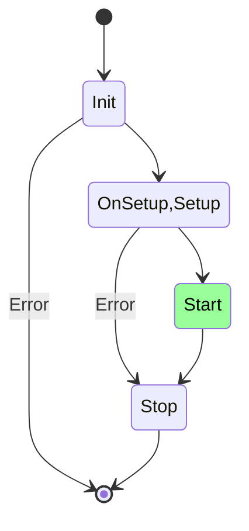

+++
title = 'Service'
date = 2024-07-13T02:34:02+07:00
draft = false
weight = 1
+++

Services in Gobs are `any` instances. All services will go through some stages as its life-cycles. The default life-cycles from gobs bootstrap follow the digram below:



Each stage has specific responsibilities in bootstrap an service.
- [Init](#initialization): Set the dependencies of a service instance
- [Setup](#setup): Configure the service after all of its dependencies are ready
- [Start](#start): Run the service after all of its dependencies are ready
- [Stop](#stop): Stop the service if service has been setup after all others depended on its stopped

### Initialization

The `Init` of services are called when `gobs.Init(ctx)` is called. 
```go {style=tokyonight-night,filename=api.go}
var _ gobs.InitService = (*API)(nil)
func (a *API) Init(ctx context.Context) (*gobs.ServiceLifeCycle, error) {
  return &gobs.ServiceLifeCycle{}, nil
}
```
The main function of `Init` of a service is to configure the dependencies of a service. The detail of configuration is in [`ServiceLifeCycle`](/docs/reference/service/service-life-cycle) struct

### Setup

The `Setup` of services are called when `gobs.Setup(ctx)` is called.
```go {style=tokyonight-night,filename=api.go}
var _ gobs.SetupService = (*API)(nil)
func (a *API) Setup(ctx context.Context) (error) {
  return nil
}

```
If the `Setup` return any error, all other `Setup` of services which is pending will be rejected.

### Start

The `Start` of services are called when `gobs.Start(ctx)` is called.
```go {style=tokyonight-night,filename=api.go}
var _ gobs.StartService = (*API)(nil)
func (a *API) Start(ctx context.Context) (error) {
  return nil
}

```
If the `Start` return any error, all other `Start` of services which is pending will be rejected.

  2 or more services depends on each others and they has `Start` pending, the other will never be started


### Stop
The `Stop` of services are called when `gobs.Stop(ctx)` is called.
```go {style=tokyonight-night,filename=api.go}
var _ gobs.StopService = (*API)(nil)
func (a *API) Stop(ctx context.Context) {
  return
}

```

  Even if the `Stop` of a service fails, Gobs will try to process to the end

